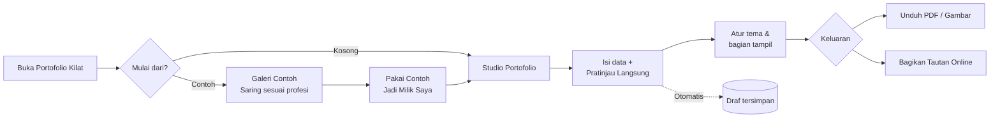

# PRD — Portofolio Kilat

Sep 25, 2026 · @Amirul

## Ringkasan produk

Portofolio Kilat adalah aplikasi web untuk membuat portofolio profesional dalam hitungan menit: isi data, pilih tampilan, lalu unduh atau bagikan tautannya. Produk berstatus **Perencanaan** dan dirilis bertahap dalam 5 fase, mencakup 7 fitur utama dan 22 sub-fitur.

Visi: siapa pun bisa punya portofolio yang rapi tanpa keahlian desain atau coding.

## Latar belakang & masalah

Membuat portofolio saat ini lambat dan menuntut keahlian desain. Masalah di bawah adalah hipotesis yang disimpulkan dari peta fitur dan perlu divalidasi lewat riset pengguna.

- **Mulai dari nol itu sulit.** Pengguna tidak tahu struktur dan isi portofolio yang baik untuk profesinya.
- **Alat desain terlalu rumit.** Mengatur warna, huruf, dan tata letak memakan waktu dan hasilnya sering tidak konsisten.
- **Format keluaran terpecah.** Rekruter meminta PDF, sementara media sosial butuh gambar atau tautan; pengguna harus membuat versi terpisah.
- **Takut kehilangan pekerjaan.** Tanpa simpan otomatis, isian panjang bisa hilang saat browser tertutup.

## Tujuan & metrik keberhasilan

Tujuan utama: pengguna baru menyelesaikan portofolio pertamanya dalam satu sesi dan membagikannya. Angka target di bawah adalah usulan awal dan perlu disepakati tim.

| Tujuan | Metrik | Target usulan | Fase terkait |
| --- | --- | --- | --- |
| Cepat jadi | Median waktu dari mulai hingga portofolio pertama lengkap | ≤ 15 menit | 1 |
| Mudah memulai | % pengguna baru yang memakai contoh dari Galeri | ≥ 40% | 1 |
| Tampil personal | % portofolio yang mengubah tema bawaan | ≥ 50% | 2 |
| Siap dipakai | % portofolio lengkap yang diunduh atau dibagikan | ≥ 60% | 3 |
| Kembali lagi | Retensi pengguna terdaftar di hari ke-30 | ≥ 25% | 4 |
| Puas | Skor kepuasan dari Kirim Masukan (skala 1–5) | ≥ 4,2 | 5 |

## Target pengguna & persona

Target utama adalah individu yang butuh portofolio cepat untuk melamar kerja atau mencari klien, lintas profesi (sub-fitur "Saring Sesuai Profesi").

| Persona | Kebutuhan utama | Fitur paling relevan |
| --- | --- | --- |
| Lulusan baru / pencari kerja | Portofolio rapi untuk dilampirkan saat melamar | Galeri Contoh, Studio Portofolio, Unduh PDF |
| Freelancer / pekerja kreatif | Tampilan yang mencerminkan gaya pribadi, mudah dibagikan ke klien | Kustomisasi Tema, Bagikan Tautan Online |
| Profesional yang beralih karier | Menonjolkan bagian tertentu, punya beberapa versi portofolio | Pilih Bagian Tampil, Daftar Portofolio Saya |

## Lingkup & roadmap

Fase 1 adalah MVP: pengguna bisa membuat portofolio dari contoh dan melihat hasilnya langsung. Semua fitur saat ini berstatus Direncanakan.

| Fase | Fitur | Sub-fitur | Hasil untuk pengguna |
| --- | --- | --- | --- |
| 1 | Studio Portofolio | Isi Data Portofolio · Pratinjau Langsung · Simpan Otomatis Draf | Membuat dan mengedit isi portofolio |
| 1 | Galeri Contoh Template | Jelajah Contoh Portofolio · Saring Sesuai Profesi · Pakai Contoh Jadi Milik Saya | Mulai dari contoh, bukan dari nol |
| 2 | Kustomisasi Tema | Pilih Palet Warna · Pilih Gaya Huruf & Tata Letak · Terapkan Tema Sekali Klik · 1 sub-fitur belum terlihat | Tampilan sesuai selera |
| 2 | Pilih Bagian Tampil | Aktif/Nonaktif Bagian · Atur Urutan Bagian · Tambah Bagian Sendiri | Struktur sesuai kebutuhan |
| 3 | Unduh & Bagikan | Unduh PDF · Unduh Gambar Pratinjau · Bagikan Tautan Online | Portofolio bisa dipakai di luar aplikasi |
| 4 | Akun & Portofolio Saya | Daftar & Masuk · Daftar Portofolio Saya · Atur Ulang Kata Sandi | Menyimpan dan mengelola banyak portofolio |
| 5 | Pengaturan & Bantuan | Profil Akun · Panduan Pemakaian · Kirim Masukan | Kelola akun, belajar, dan memberi masukan |

Nama "Galeri Contoh Template", "Akun & Portofolio Saya", dan "Pengaturan & Bantuan" dilengkapi dari label yang terpotong di peta fitur.

## Kebutuhan fungsional — Fase 1

Fase 1 berjalan tanpa akun, karena Daftar & Masuk baru hadir di Fase 4. Draf disimpan di perangkat pengguna sampai akun tersedia.

### Studio Portofolio

Sebagai pengguna, saya ingin mengisi data portofolio dan langsung melihat hasilnya agar tahu tampilannya sebelum dibagikan.

| ID | Sub-fitur | Kebutuhan | Kriteria penerimaan |
| --- | --- | --- | --- |
| SP-1 | Isi Data Portofolio | Formulir terstruktur untuk profil, ringkasan, pengalaman, pendidikan, keahlian, proyek, dan kontak | Setiap bagian bisa ditambah, diedit, dan dihapus; kolom wajib divalidasi dengan pesan yang jelas |
| SP-2 | Isi Data Portofolio | Unggah foto profil dan gambar proyek | Format JPG/PNG/WebP; batas ukuran per file ditampilkan sebelum unggah |
| SP-3 | Pratinjau Langsung | Pratinjau diperbarui saat pengguna mengetik | Perubahan tampil ≤ 500 ms; tampilan desktop dan seluler bisa diganti |
| SP-4 | Simpan Otomatis Draf | Draf tersimpan otomatis tanpa tombol simpan | Tersimpan tiap perubahan (debounce \~2 detik); indikator "Tersimpan" terlihat; draf pulih setelah browser ditutup |

### Galeri Contoh Template

Sebagai pengguna, saya ingin melihat contoh portofolio sesuai profesi saya dan memakainya sebagai titik awal.

| ID | Sub-fitur | Kebutuhan | Kriteria penerimaan |
| --- | --- | --- | --- |
| GC-1 | Jelajah Contoh Portofolio | Galeri berisi kartu pratinjau contoh portofolio | Setiap kartu menampilkan gambar kecil, nama, dan profesi; bisa dibuka dalam pratinjau penuh |
| GC-2 | Saring Sesuai Profesi | Filter berdasarkan kategori profesi | Filter bisa dikombinasikan dengan pencarian kata kunci; jumlah hasil ditampilkan |
| GC-3 | Pakai Contoh Jadi Milik Saya | Menyalin contoh menjadi draf milik pengguna | Satu klik membuka Studio dengan isi dan tema contoh; contoh asli tidak berubah |

## Kebutuhan fungsional — Fase 2

Fase 2 memberi kendali atas tampilan dan struktur portofolio tanpa mengubah isinya.

### Kustomisasi Tema

Sebagai pengguna, saya ingin mengubah warna, huruf, dan tata letak agar portofolio mencerminkan gaya saya.

| ID | Sub-fitur | Kebutuhan | Kriteria penerimaan |
| --- | --- | --- | --- |
| KT-1 | Pilih Palet Warna | Pilihan palet warna siap pakai | Minimal 8 palet; semua kombinasi teks-latar memenuhi kontras WCAG AA |
| KT-2 | Pilih Gaya Huruf & Tata Letak | Pasangan huruf dan varian tata letak | Minimal 5 pasangan huruf dan 3 tata letak; perubahan langsung terlihat di pratinjau |
| KT-3 | Terapkan Tema Sekali Klik | Tema lengkap (warna + huruf + tata letak) diterapkan sekaligus | Satu klik mengganti seluruh tampilan; bisa dibatalkan (undo) |
| KT-4 | Sub-fitur ke-4 | Belum terlihat di peta fitur ("Lihat semua (4)") | Perlu dilengkapi |

### Pilih Bagian Tampil

Sebagai pengguna, saya ingin memilih dan mengurutkan bagian yang tampil agar portofolio fokus pada hal terpenting.

| ID | Sub-fitur | Kebutuhan | Kriteria penerimaan |
| --- | --- | --- | --- |
| PB-1 | Aktif/Nonaktif Bagian | Sakelar per bagian | Bagian nonaktif hilang dari pratinjau dan hasil unduhan, tetapi datanya tetap tersimpan |
| PB-2 | Atur Urutan Bagian | Urutan bagian bisa diubah | Seret-dan-lepas di desktop; tombol naik/turun di seluler dan untuk keyboard |
| PB-3 | Tambah Bagian Sendiri | Bagian kustom dengan judul bebas | Pengguna mengisi judul dan isi teks/daftar; bagian ikut tema aktif |

## Kebutuhan fungsional — Fase 3–5

Fase 3 membawa portofolio keluar dari aplikasi, Fase 4 menambah akun, dan Fase 5 melengkapi pengaturan serta bantuan.

### Unduh & Bagikan (Fase 3)

Sebagai pengguna, saya ingin mengunduh atau membagikan portofolio dalam format yang diminta penerima.

| ID | Sub-fitur | Kebutuhan | Kriteria penerimaan |
| --- | --- | --- | --- |
| UB-1 | Unduh PDF | Ekspor ke PDF ukuran A4 | Teks bisa dipilih dan dicari (bukan gambar); tampilan sama dengan pratinjau; selesai ≤ 10 detik |
| UB-2 | Unduh Gambar Pratinjau | Ekspor gambar untuk media sosial | Format PNG; ukuran siap pakai minimal untuk feed persegi dan banner |
| UB-3 | Bagikan Tautan Online | Portofolio diterbitkan di URL publik | Tautan bisa disalin; bisa dinonaktifkan kapan saja; halaman memiliki pratinjau tautan (judul, gambar) |

### Akun & Portofolio Saya (Fase 4)

Sebagai pengguna, saya ingin menyimpan portofolio di akun agar bisa diakses dari perangkat mana pun.

| ID | Sub-fitur | Kebutuhan | Kriteria penerimaan |
| --- | --- | --- | --- |
| AP-1 | Daftar & Masuk | Registrasi dan login dengan email + kata sandi | Draf lokal dari Fase 1–3 otomatis dipindahkan ke akun setelah daftar |
| AP-2 | Daftar Portofolio Saya | Daftar semua portofolio milik pengguna | Bisa membuat, membuka, menggandakan, mengganti nama, dan menghapus (dengan konfirmasi) |
| AP-3 | Atur Ulang Kata Sandi | Reset kata sandi lewat email | Tautan reset kedaluwarsa dalam 60 menit dan hanya bisa dipakai sekali |

### Pengaturan & Bantuan (Fase 5)

Sebagai pengguna, saya ingin mengelola akun dan mendapat bantuan saat bingung.

| ID | Sub-fitur | Kebutuhan | Kriteria penerimaan |
| --- | --- | --- | --- |
| PG-1 | Profil Akun | Ubah nama, email, kata sandi; hapus akun | Perubahan email diverifikasi ulang; hapus akun menghapus semua data pribadi |
| PG-2 | Panduan Pemakaian | Panduan langkah demi langkah dan FAQ | Bisa diakses dari setiap halaman; mencakup semua fitur Fase 1–4 |
| PG-3 | Kirim Masukan | Formulir masukan di dalam aplikasi | Pengguna memberi nilai 1–5 dan komentar; tim menerima masukan beserta konteks halaman |

## Alur pengguna utama

Alur inti: pilih contoh atau mulai kosong, isi data, atur tampilan, lalu unduh atau bagikan.

Setelah Fase 4, pengguna yang masuk melihat Daftar Portofolio Saya sebagai halaman awal, bukan pilihan "Mulai dari?".

## Kebutuhan non-fungsional

Aplikasi harus cepat, dapat diakses, dan aman untuk data pribadi pengguna. Target angka di bawah adalah usulan awal.

| Aspek | Kebutuhan |
| --- | --- |
| Kinerja | Halaman awal termuat ≤ 2,5 detik (LCP) di koneksi 4G; pratinjau diperbarui ≤ 500 ms |
| Responsif | Berfungsi penuh di desktop, tablet, dan seluler (lebar layar mulai 360 px) |
| Aksesibilitas | Memenuhi WCAG 2.1 AA: kontras, navigasi keyboard, label pembaca layar |
| Bahasa | Antarmuka Bahasa Indonesia; teks disiapkan untuk terjemahan (i18n) |
| Keamanan | HTTPS di semua halaman; kata sandi di-hash; pembatasan percobaan login |
| Privasi | Sesuai UU PDP No. 27/2022; tautan publik tidak bisa diindeks mesin pencari kecuali pengguna mengizinkan |
| Keandalan | Ketersediaan ≥ 99,5% per bulan; tidak ada kehilangan draf saat koneksi putus |
| Peramban | Dua versi terakhir Chrome, Safari, Firefox, dan Edge |

## Di luar lingkup, asumsi & risiko

### Di luar lingkup (versi ini)

- Login dengan Google/LinkedIn, kolaborasi multi-pengguna, dan domain kustom.
- Pembuatan isi otomatis dengan AI dan impor dari LinkedIn atau CV.
- Aplikasi seluler native dan fitur berbayar.

### Asumsi

- Pengguna nyaman mengisi data sendiri lewat formulir.
- Penyimpanan draf di perangkat cukup untuk Fase 1–3 sebelum akun tersedia.

### Risiko

| Risiko | Dampak | Mitigasi |
| --- | --- | --- |
| Draf lokal hilang jika pengguna menghapus data browser sebelum Fase 4 | Pengguna kehilangan pekerjaan dan kepercayaan | Peringatan di Studio; opsi ekspor/impor draf; pertimbangkan memajukan akun |
| Hasil PDF berbeda dari pratinjau | Portofolio terlihat rusak di mata rekruter | Satu mesin render untuk pratinjau dan PDF; uji visual otomatis |
| Tautan publik membuka data pribadi (telepon, alamat) | Masalah privasi | Peringatan sebelum menerbitkan; kolom sensitif bisa disembunyikan |

### Pertanyaan terbuka

- [ ] Apa sub-fitur ke-4 Kustomisasi Tema?
- [ ] Apakah Daftar & Masuk perlu dimajukan agar draf dan tautan online (Fase 3) punya pemilik?
- [ ] Kategori profesi apa saja yang tersedia di Galeri, dan berapa contoh per kategori saat peluncuran?
- [ ] Apakah ada model monetisasi (misalnya tema premium) yang memengaruhi roadmap?
- [ ] Siapa pemilik produk dan berapa target tanggal tiap fase?
